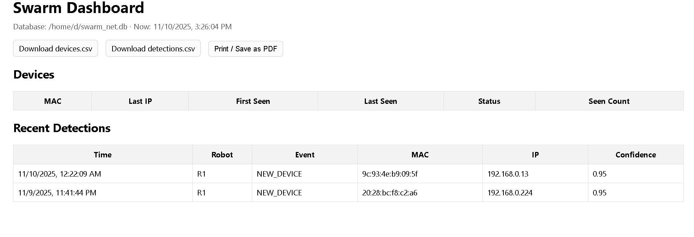

# Swarm Verification Lab

### Overview
This project explores distributed robot communication and verification using 
Raspberry Pi devices (R1–Rn) and a central manager node (M1). 
Robots detect network events, report findings via MQTT, and verify each other's detections 
before logging confirmed results to the manager. 
ROS 2 integration extends this architecture into simulated swarm experiments.

---

### 🧠 Project Goals
- Develop a modular framework for multi-agent coordination over LAN.
- Compare MQTT and ROS 2 communication performance and reliability.
- Design a simple verification mechanism (K-of-N confirmation) between agents.
- Log and visualize swarm detections for later analysis.
- Prepare groundwork for simulation in Gazebo using ROS 2.

---

## 🏗️ System Architecture
[ Robots R1…Rn ]

↳ robot_net_agent.py

↳ Publishes detections via MQTT

▼

[ M1 Manager ]

↳ Mosquitto broker (1883)

↳ manager_net.py → SQLite (swarm_net.db)

↳ swarm_dashboard.py (Flask Web UI)

▼

[ ROS 2 Bridge ]

↳ mqtt_to_ros node → publishes /swarm/detection

---

---

## 🚀 Quick Start

### ✅ Tested on
- **M1 (Manager):** Linux Mint 21.1 “Vera” (Ubuntu 22.04 base), Python 3.10  
- **R1 (Robot Node):** Raspberry Pi 5, Raspberry Pi OS (Trixie 64-bit), Python 3.11  
- **MQTT Broker:** Mosquitto 2.x  
- **ROS 2:** Humble (via Docker on R1)

---

### 🖥️ M1 — Manager Setup

#### 1. Install dependencies
```bash
sudo apt update
sudo apt install -y mosquitto mosquitto-clients python3-paho-mqtt python3-flask sqlite3
```
#### 2. Enable The Broker
```bash
sudo tee /etc/mosquitto/conf.d/lab.conf <<'EOF'
listener 1883 0.0.0.0
allow_anonymous true
EOF
sudo systemctl enable --now mosquitto
```
#### 3. Start the manager and dashboard
```bash
python3 manager_net.py
python3 swarm_dashboard.py    # then open http://M1_IP:8088 in a browser
```
### 🤖 R1 — Robot Node Setup

#### 1. Install dependencies
```bash
sudo apt update
sudo apt install -y python3-paho-mqtt python3-requests docker.io
sudo usermod -aG docker $USER && newgrp docker
```
#### 2. Configure the robot agent
```bash
nano robot_net_agent.py
# Set the MQTT broker address to your M1 IP:
# BROKER_IP = "M1.local"
```
#### 3. Enable and start the agent
```bash
sudo systemctl enable --now robot-net-agent
sudo tail -f /var/log/robot_agent.log
```
---

## 📸 Screenshots



---

## 🧯 Troubleshooting

| Problem | Likely Cause | Solution |
|----------|---------------|----------|
| `ros2: command not found` on R1 | ROS 2 not installed natively | Run listener in Docker container (see R1 steps) |
| No data received on M1 | MQTT broker or IP misconfigured | Check `BROKER_IP` in `robot_net_agent.py` and verify port 1883 open |
| Dashboard shows no devices | Robot agent not publishing | Check `sudo systemctl status robot-net-agent` and `/var/log/robot_agent.log` |
| Container listener sees nothing | ROS 2 domain mismatch | Ensure both systems set `ROS_DOMAIN_ID=42` and `--net=host` used |
| Permission denied during apt | Missing `sudo` | Prefix with `sudo` or run as root |
| SQLite database empty | Manager not subscribed | Confirm `manager_net.py` running and connected to MQTT topic |

---

