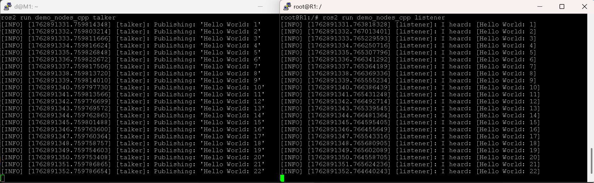

# Swarm Verification Lab

### Overview
This project explores distributed robot communication and verification using 
Raspberry Pi devices (R1–Rn) and a central manager node (M1). 
Robots detect network events, report findings via MQTT, and verify each other's detections 
before logging confirmed results to the manager. 
ROS 2 integration extends this architecture into simulated swarm experiments.

---

### 🧠 Project Goals
- Develop a modular framework for multi-agent coordination over LAN.
- Compare MQTT and ROS 2 communication performance and reliability.
- Design a simple verification mechanism (K-of-N confirmation) between agents.
- Log and visualize swarm detections for later analysis.
- Prepare groundwork for simulation in Gazebo using ROS 2.

---

## 🏗️ System Architecture
[ Robots R1…Rn ]
↳ robot_net_agent.py
↳ Publishes detections via MQTT
│
▼
[ M1 Manager ]
↳ Mosquitto broker (1883)
↳ manager_net.py → SQLite (swarm_net.db)
↳ swarm_dashboard.py (Flask Web UI)
│
▼
[ ROS 2 Bridge ]
↳ mqtt_to_ros node → publishes /swarm/detection

---

## 📸 Screenshots

---
